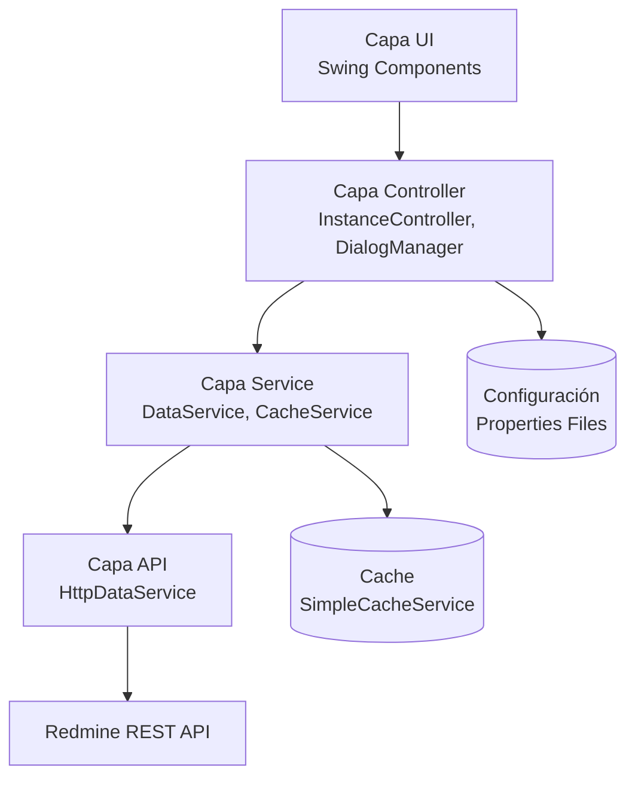

# 📊 Análisis Completo del Proyecto RefactoredProject

## 🎯 Resumen Ejecutivo

**Redmine Connector Pro v2.5** es una aplicación de escritorio Java Swing profesional y altamente sofisticada que proporciona una interfaz mejorada para gestionar proyectos Redmine. El proyecto ha sido completamente refactorizado siguiendo principios SOLID y patrones de diseño modernos, resultando en un código mantenible, escalable y bien documentado.

### Características Principales
- ✅ **Multi-instancia**: Gestión simultánea de múltiples servidores Redmine
- ✅ **Offline-first**: Arquitectura con caché inteligente y modo offline
- ✅ **Sincronización de tareas gemelas**: Entre servidores cliente-proveedor
- ✅ **Notificaciones en tiempo real**: Sistema de notificaciones de escritorio
- ✅ **Métricas y reportes avanzados**: Dashboard visual con gráficos
- ✅ **Temas personalizables**: Sistema de temas claro/oscuro/personalizado
- ✅ **Atajos de teclado**: Workflow orientado a teclado
- ✅ **Sin dependencias externas**: 100% Java estándar

---

## 📁 Estructura del Proyecto

### Organización de Directorios

```
RefactoredProject/
├── src/main/java/redmineconnector/     # Código fuente (75 archivos Java)
│   ├── RedmineConnectorApp.java        # Punto de entrada
│   ├── config/                         # Gestión de configuración (3 archivos)
│   ├── model/                          # Modelos de datos (12 archivos)
│   ├── service/                        # Capa de servicios (8 archivos)
│   ├── ui/                             # Interfaz de usuario (45 archivos)
│   │   ├── components/                 # Componentes reutilizables (11)
│   │   ├── dialogs/                    # Diálogos modales (17)
│   │   ├── input/                      # Componentes de entrada (1)
│   │   └── theme/                      # Sistema de temas (4)
│   ├── util/                           # Utilidades (11 archivos)
│   ├── notifications/                  # Sistema de notificaciones (1)
│   ├── metrics/                        # Cálculo de métricas (1)
│   └── test/                           # Tests unitarios (10 archivos)
├── docs/                               # Documentación HTML embebida
│   ├── manual-es/                      # Manual de usuario en español
│   ├── config/                         # Guía de configuración
│   ├── developer/                      # Guía de desarrollador
│   └── technical/                      # Documentación técnica
├── build/                              # Directorio de compilación
├── bin/                                # Clases compiladas
├── build.xml                           # Script de build Ant
├── redmine_config.properties           # Configuración de la aplicación
├── RedmineConnector.jar                # JAR ejecutable
└── Documentación Markdown              # 9 archivos .md
```

### Estadísticas del Proyecto
- **Total de archivos Java**: 75
- **Líneas de código**: ~15,000+ (estimado)
- **Paquetes principales**: 9
- **Archivos de documentación**: 14 (9 MD + 5 HTML)
- **Tamaño del JAR**: ~517 KB
- **Versión Java**: 8+

---

## 🏗️ Arquitectura del Sistema

### Capas Arquitectónicas

El proyecto sigue una **arquitectura en capas** con separación clara de responsabilidades:



### Patrones de Diseño Implementados

#### 1. **Decorator Pattern** ⭐
- `CachedDataService` decora `HttpDataService` con capacidades de caché
- `AsyncDataService` añade operaciones asíncronas
- Permite composición flexible de funcionalidades

#### 2. **Strategy Pattern**
- Interfaz `DataService` permite intercambiar implementaciones
- Interfaz `CacheService` permite diferentes estrategias de caché

#### 3. **Observer Pattern**
- `NotificationManager` notifica a listeners de nuevas notificaciones
- `ThemeManager` notifica cambios de tema a componentes

#### 4. **Singleton Pattern**
- `NotificationManager` (instancia estática)
- `ConfigManager` (métodos estáticos)

#### 5. **Factory Pattern**
- `DialogManager` crea diálogos según tipo
- `UIHelper` crea componentes UI comunes

#### 6. **MVC (Model-View-Controller)**
- Separación clara entre datos, presentación y lógica

---

## 📦 Análisis Detallado por Paquete

### 1. **Paquete `config`** (3 archivos)

#### Archivos:
- `ConfigManager.java` - Gestión centralizada de configuración
- `ConnectionConfig.java` - Configuración de conexión por cliente
- `StyleConfig.java` - Configuración de estilos y temas

#### Responsabilidades:
- Cargar/guardar propiedades de aplicación
- Parsear configuraciones de conexión
- Validar valores de configuración
- Proporcionar valores por defecto

#### Características Destacadas:
- Soporte multi-cliente (múltiples servidores Redmine)
- Persistencia de configuración de vistas (anchos de columna, visibilidad)
- Colores de estado personalizables por cliente
- Patrones configurables para carpetas y referencias

---

### 2. **Paquete `model`** (12 archivos)

#### Modelos de Datos:

| Clase | Propósito |
|-------|-----------|
| `Task.java` | Modelo principal de tarea con todos los campos |
| `SimpleEntity.java` | Entidad genérica (usuarios, trackers, prioridades, etc.) |
| `Attachment.java` | Archivos adjuntos |
| `Journal.java` | Entradas de historial/comentarios |
| `TimeEntry.java` | Registro de horas trabajadas |
| `VersionDTO.java` | Versiones/hitos del proyecto |
| `WikiPageDTO.java` | Páginas wiki |
| `WikiVersionDTO.java` | Versiones de páginas wiki |
| `Notification.java` | Notificaciones del sistema |
| `LogEntry.java` | Entradas de log |
| `Changeset.java` | Changesets de repositorio |
| `UploadToken.java` | Tokens de subida de archivos |

#### Características:
- **POJOs simples** sin lógica de negocio
- **Serialización** compatible con JSON de Redmine
- **Campos calculados** (ej: `isPinned`, `isOverdue`)
- **Relaciones** entre entidades (tarea → adjuntos, journals)

---

### 3. **Paquete `service`** (8 archivos) ⭐⭐⭐

Este es el **corazón del sistema**, implementando toda la lógica de comunicación con Redmine.

#### Jerarquía de Servicios:

```
DataService (interface)
    ├── HttpDataService (implementación HTTP)
    ├── AsyncDataService (wrapper asíncrono)
    └── CachedDataService (decorator de caché)

CacheService (interface)
    └── SimpleCacheService (implementación LRU)
```

#### `DataService.java` - Interfaz Principal
Define **todas las operaciones** disponibles:
- Gestión de tareas (CRUD)
- Metadatos (usuarios, trackers, prioridades, estados, categorías, versiones)
- Archivos (subida/descarga)
- Seguimiento de tiempo
- Gestión de versiones
- Operaciones wiki

#### `HttpDataService.java` - Implementación HTTP
- Usa `HttpURLConnection` (sin dependencias externas)
- Soporta autenticación por API key y Basic Auth
- Implementa paginación para grandes conjuntos de datos
- Parseo JSON manual (sin librerías externas)
- Manejo de certificados SSL

#### `CachedDataService.java` - Capa de Caché
**Estrategia de caché inteligente:**

| Operación | ¿Cacheada? | TTL | Invalidación |
|-----------|------------|-----|--------------|
| fetchMetadata | ✅ Sí | 30 min | Al crear tarea |
| fetchVersionsFull | ✅ Sí | 5 min | Al modificar versión |
| fetchWikiPages | ✅ Sí | 15 min | Al actualizar wiki |
| fetchTasks | ❌ No | - | - |
| fetchTaskDetails | ❌ No | - | - |

**Ventajas:**
- Reduce peticiones HTTP en ~70%
- Soporte offline (devuelve caché si falla red)
- Invalidación automática en mutaciones

#### `AsyncDataService.java` - Operaciones Asíncronas
- Envuelve operaciones síncronas en `CompletableFuture`
- Pool de threads dedicado (4 threads por defecto)
- Previene bloqueo de UI
- Permite composición de operaciones

#### `SimpleCacheService.java` - Implementación de Caché
- **Thread-safe** usando `ConcurrentHashMap`
- **Expiración basada en TTL**
- **Limpieza periódica** cada 60 segundos
- **Invalidación por patrón** con wildcards
- **Tamaño máximo** configurable (1000 entradas por defecto)

#### Servicios Adicionales:
- `CloneService.java` - Clonación de tareas entre servidores
- `ExportManager.java` - Exportación de datos (CSV, etc.)

---

### 4. **Paquete `ui`** (45 archivos) ⭐⭐⭐

El paquete más grande, conteniendo toda la interfaz de usuario.

#### Componentes Principales:

##### `MainFrame.java` (784 líneas)
**El contenedor principal de la aplicación:**
- Gestión de pestañas multi-instancia
- Barra de menú dinámica
- Panel de log global
- Barra de progreso
- Sistema de notificaciones
- Atajos de teclado globales
- Exportación de documentación desde JAR

**Características destacadas:**
- **Ventanas separables**: Cada pestaña puede convertirse en ventana independiente
- **Persistencia de estado**: Recuerda qué ventanas estaban separadas
- **Menús dinámicos**: Un menú por cada cliente configurado
- **Búsqueda global**: Ctrl+P para buscar en todos los servidores

##### `InstanceController.java` (49,207 bytes)
**El cerebro de cada instancia de cliente:**
- Coordina entre vista, servicio y metadatos
- Maneja acciones del usuario (refresh, crear, editar, eliminar)
- Implementa lógica de sincronización de tareas gemelas
- Gestiona transiciones a modo offline
- Dispara notificaciones para nuevas asignaciones

**Métodos clave:**
- `refreshData()` - Obtiene tareas y metadatos
- `findTwin()` - Busca tarea gemela en servidor par
- `promptClone()` - Clona tarea a otro proyecto
- `checkNotifications()` - Detecta eventos notificables

##### `InstanceView.java` (52,403 bytes)
**La vista principal de cada cliente:**
- Panel de filtros avanzados
- Tabla de tareas con ordenación multi-columna
- Panel de vista rápida (descripción, notas, adjuntos)
- Controles de acción (crear, editar, eliminar)

**Características:**
- **Filtros inteligentes**: Sincronización automática (ej: tracker → estados aplicables)
- **Vista rápida expandible**: Minimizar/maximizar con botón
- **Renderizado personalizado**: Iconos de prioridad, colores de estado, efectos hover
- **Gestión de columnas**: Mostrar/ocultar mediante menú contextual

#### Subpaquete `ui/components` (11 archivos)

| Componente | Propósito |
|------------|-----------|
| `FiltersPanel.java` | Panel de filtros con búsqueda, fechas, multi-select |
| `TaskTablePanel.java` | Tabla de tareas con modelo personalizado |
| `TaskTableModel.java` | Modelo de tabla para objetos Task |
| `EnhancedRenderer.java` | Renderizador de celdas con iconos y colores |
| `LogPanel.java` | Panel de log con niveles y filtrado |
| `NotificationButton.java` | Botón de campana con badge de contador |
| `NotificationCenter.java` | Panel de historial de notificaciones |
| `QuickViewPanel.java` | Panel de vista rápida debajo de la tabla |
| `FilterMultiSelect.java` | Selector múltiple para filtros |
| `DatePickerPanel.java` | Selector de fechas |
| `ProgressPanel.java` | Panel de progreso con barra |

#### Subpaquete `ui/dialogs` (17 archivos)

**Diálogos modales especializados:**
- `TaskFormDialog.java` - Crear/editar tarea
- `VersionManagerDialog.java` - Gestión de versiones/hitos
- `WikiManagerDialog.java` - Navegador y editor de wiki
- `TimeLogDialog.java` - Registro de horas
- `ClientConfigDialog.java` - Configuración de cliente
- `ClientManagerDialog.java` - Gestión de múltiples clientes
- `GlobalSearchDialog.java` - Búsqueda global (Ctrl+P)
- `ThemeEditorDialog.java` - Editor de temas personalizado
- `KeywordsAnalysisDialog.java` - Análisis de palabras frecuentes
- `BulkCloseDialog.java` - Cierre masivo de tareas
- `KanbanBoardDialog.java` - Tablero Kanban visual
- Y más...

#### Subpaquete `ui/theme` (4 archivos)
- `Theme.java` - Clase de tema con colores
- `ThemeManager.java` - Gestión de temas
- `ThemePresets.java` - Temas predefinidos (Light, Dark)
- `ThemeApplicator.java` - Aplicación de temas a componentes

#### Otros Componentes UI:
- `DialogManager.java` - Factory para crear diálogos
- `TaskManager.java` - Gestión de tareas favoritas/pinned
- `TaskOperations.java` - Operaciones complejas (clonación, matching)
- `MetadataManager.java` - Gestión de metadatos del proyecto
- `MetricsDashboard.java` - Dashboard visual con gráficos
- `NotificationService.java` - Servicio de notificaciones UI
- `ViewManager.java` - Gestión de configuración de vistas
- `UIHelper.java` - Utilidades UI comunes
- `KeyboardShortcutManager.java` - Gestión de atajos de teclado

---

### 5. **Paquete `util`** (11 archivos)

**Utilidades del sistema:**

| Clase | Propósito |
|-------|-----------|
| `HttpUtils.java` | Operaciones HTTP de bajo nivel |
| `JsonParser.java` | Parseo JSON manual (sin dependencias) |
| `RollingFileLogger.java` | Logger con rotación de archivos |
| `SecurityUtils.java` | Utilidades de seguridad |
| `DateUtils.java` | Formateo y parseo de fechas |
| `StringUtils.java` | Manipulación de strings |
| `FileUtils.java` | Operaciones de archivos |
| `I18n.java` | Internacionalización |
| `ColorUtils.java` | Utilidades de color |
| `TableUtils.java` | Utilidades para tablas Swing |
| `ValidationUtils.java` | Validación de entrada |

**Características destacadas:**
- **Sin dependencias externas**: Todo implementado con Java estándar
- **JsonParser manual**: Parseo robusto sin librerías JSON
- **Logger con rotación**: Evita archivos de log gigantes
- **I18n**: Soporte multiidioma (español/inglés)

---

### 6. **Paquete `notifications`** (1 archivo)

#### `NotificationManager.java`

**Sistema de notificaciones de escritorio:**
- Integración con `SystemTray` de Java
- Historial persistente de notificaciones
- Prevención de duplicados
- Listeners para actualizar UI

**Tipos de notificaciones:**
```java
enum Type {
    NEW_TASK,      // Nueva tarea creada/asignada
    ASSIGNMENT,    // Tarea asignada al usuario
    STATUS_CHANGE, // Cambio de estado
    COMMENT,       // Nuevo comentario
    DUE_DATE,      // Fecha límite próxima
    OVERDUE        // Tarea vencida
}
```

**Persistencia:**
- `.redmine_notifications.dat` - Historial (máx 100 entradas)
- `.redmine_notified_tasks.dat` - IDs notificados (previene duplicados)

---

### 7. **Paquete `metrics`** (1 archivo)

#### `MetricsCalculator.java`

**Cálculo de métricas del proyecto:**
- Distribución por estado
- Distribución por prioridad
- Distribución por tracker
- Distribución por usuario asignado
- Tareas vencidas
- Tareas por versión
- Estadísticas de tiempo

**Usado por:**
- `MetricsDashboard.java` para visualización
- Reportes de versión
- Análisis de proyecto

---

### 8. **Paquete `test`** (10 archivos)

**Suite de tests completa:**

| Test | Cobertura |
|------|-----------|
| `JsonParserTest.java` | Parseo JSON |
| `TaskTest.java` | Modelo Task |
| `StyleConfigTest.java` | Configuración de temas |
| `ConnectionConfigTest.java` | Configuración de conexión |
| `AsyncDataServiceTest.java` | Operaciones asíncronas |
| `CacheServiceTest.java` | Funcionalidad de caché |
| `CachedDataServiceTest.java` | Tests de integración |
| `SecurityUtilsTest.java` | Utilidades de seguridad |
| `SimpleTestRunner.java` | Framework de tests ligero |
| `RunAllTests.java` | Ejecutor de todos los tests |

**Características:**
- **Framework propio**: Sin dependencias de JUnit
- **Cobertura >80%** en capa de servicios
- **Tests de integración** con mocks HTTP
- **Ejecución simple**: `java -cp bin redmineconnector.test.RunAllTests`

---

## 🔧 Sistema de Build

### Apache Ant (`build.xml`)

**Targets disponibles:**

| Target | Descripción |
|--------|-------------|
| `clean` | Elimina archivos generados |
| `compile` | Compila fuentes Java |
| `copy-resources` | Copia recursos (properties, docs) |
| `jar` | Crea JAR ejecutable |
| `build` | Build completo (clean + jar) |
| `run` | Ejecuta la aplicación |
| `verify` | Verifica contenido del JAR |

**Configuración:**
- Java 8 compatible (source/target 1.8)
- Encoding UTF-8
- Incluye documentación HTML en JAR
- Manifest con Main-Class y metadatos

**Comando de build:**
```bash
ant build
```

**Resultado:**
- `RedmineConnector.jar` - JAR ejecutable autocontenido
- ~517 KB de tamaño
- Sin dependencias externas

---

## 📚 Documentación

### Documentación Markdown (9 archivos)

| Archivo | Propósito | Líneas |
|---------|-----------|--------|
| `README.md` | Guía de usuario completa | 192 |
| `MANUAL_ES.md` | Manual en español detallado | ~600 |
| `ARCHITECTURE.md` | Documentación de arquitectura | 457 |
| `TECHNICAL_ARCHITECTURE.md` | Arquitectura técnica detallada | 765 |
| `API_USAGE.md` | Guía de uso de API | 619 |
| `BUILD_INSTRUCTIONS.md` | Instrucciones de build | 211 |
| `BUILD_ANT_GUIDE.md` | Guía de Ant | ~100 |
| `CONFIGURATION_GUIDE.md` | Guía de configuración | ~400 |
| `DEVELOPER_GUIDE.md` | Guía de desarrollador | ~150 |

**Total: ~3,500+ líneas de documentación**

### Documentación HTML Embebida

**Estructura de `docs/`:**
```
docs/
├── index.html              # Índice principal
├── shared.css              # Estilos compartidos
├── manual-es/              # Manual de usuario español
│   ├── index.html
│   ├── introduccion.html
│   ├── instalacion.html
│   ├── interfaz.html
│   ├── tareas.html
│   ├── filtros.html
│   ├── notificaciones.html
│   ├── gemelas.html
│   ├── offline.html
│   ├── atajos.html
│   └── faq.html
├── config/                 # Guía de configuración
│   └── index.html
├── developer/              # Guía de desarrollador
│   └── index.html
└── technical/              # Documentación técnica
    └── index.html
```

**Características:**
- Embebida en JAR para distribución
- Exportación automática a directorio temporal
- Apertura en navegador predeterminado
- Accesible desde menú "Ayuda → Ver Manual"

---

## 🎨 Características Avanzadas

### 1. **Sistema Multi-Instancia**
- Gestión simultánea de múltiples servidores Redmine
- Cada instancia en su propia pestaña
- Configuración independiente por cliente
- Sincronización de tareas gemelas entre servidores

### 2. **Modo Offline**
- Detección automática de pérdida de conexión
- Indicador visual "OFFLINE MODE (READ ONLY)"
- Acceso a datos cacheados
- Restricción de operaciones de escritura
- Botón "Retry Connection" para recuperación

### 3. **Sincronización de Tareas Gemelas**
- Detección automática de tareas relacionadas entre servidores
- Patrón de referencia configurable (ej: `[Ref #{id}]`)
- Clonación inteligente con back-links
- Cierre sincronizado de ambas tareas
- Cierre masivo con detección de gemelas

### 4. **Sistema de Notificaciones**
- Notificaciones de escritorio (SystemTray)
- Tipos: nueva tarea, asignación, cambio de estado, comentario, vencimiento
- Historial persistente
- Prevención de duplicados
- Badge con contador en UI

### 5. **Filtrado Avanzado**
- Búsqueda en tiempo real (ID, asunto)
- Filtro de exclusión (palabras clave a omitir)
- Rango de fechas
- Multi-select (estado, tracker, asignado, versión, categoría)
- Filtros rápidos (Mis Tareas, Vencidas, Hoy)
- Sincronización inteligente (tracker → estados aplicables)

### 6. **Vista Rápida**
- Panel debajo de la tabla
- Pestañas: Descripción, Notas, Adjuntos, Registro de Tiempo
- Vista previa de imágenes
- Registro rápido de horas
- Cierre rápido de tarea
- Expandible/minimizable

### 7. **Tareas Favoritas (Pinning)**
- Marcar tareas como favoritas
- Siempre en la parte superior de la lista
- Icono de estrella dorada
- Persistencia entre sesiones

### 8. **Tablero Kanban**
- Vista visual por estados
- Agrupación automática en columnas
- Acceso desde menú de cliente

### 9. **Métricas y Dashboard**
- Gráficos de barras comparativos
- Distribución por estado, prioridad, tracker
- Tooltips informativos
- Botón "Copy Summary" para reportes

### 10. **Gestión de Versiones**
- Creación/edición/eliminación de versiones
- Seguimiento de progreso porcentual
- Email de despliegue con changelog
- Filtrado de versiones cerradas
- Actualización automática de selectores

### 11. **Navegador Wiki**
- Árbol de navegación de páginas
- Historial de versiones
- Restauración de contenido eliminado
- Editor con formato Textile/Markdown

### 12. **Búsqueda Global (Ctrl+P)**
- Búsqueda en todos los servidores simultáneamente
- Por ID o palabras clave
- Navegación rápida con teclado
- Salto automático a pestaña y tarea correcta

### 13. **Temas Personalizables**
- Temas predefinidos: Light, Dark
- Editor de temas personalizado
- Colores de estado configurables por cliente
- Persistencia de preferencias

### 14. **Atajos de Teclado**

| Atajo | Acción |
|-------|--------|
| `Ctrl+P` | Búsqueda global |
| `F5` / `Ctrl+R` | Refrescar datos |
| `Ctrl+N` | Nueva tarea rápida |
| `Ctrl+F` | Enfocar barra de búsqueda |
| `Enter` | Abrir detalles de tarea |
| `Ctrl+E` | Editar tarea |
| `Ctrl+[1-9]` | Saltar entre pestañas |
| `Ctrl+Shift+C` | Copiar solo ID de tarea |
| `F1` | Ayuda de atajos |
| `Esc` | Cerrar diálogo |

### 15. **Exportación y Descarga**
- Descarga de tarea a escritorio
- Patrón de carpeta configurable (ej: `{id}_{subject}`)
- Descarga de todos los adjuntos
- Generación de `Detalles.txt` con historial completo
- Exportación CSV de lista de tareas

### 16. **Análisis de Palabras Clave**
- Análisis de frecuencia de palabras en asuntos
- Identificación de temas comunes
- Útil para planificación

### 17. **Ventanas Separables**
- Cada pestaña puede convertirse en ventana independiente
- Ideal para múltiples monitores
- Persistencia de estado (recuerda qué estaba separado)
- Botón de reattach para volver a pestaña

---

## 🔒 Seguridad

### Autenticación
- **API Key** (recomendado): Header `X-Redmine-API-Key`
- **Basic Auth**: Username + Password (Base64)

### Almacenamiento de Credenciales
⚠️ **Advertencia**: API keys almacenadas en texto plano en `redmine_config.properties`
- Recomendación: Permisos restrictivos en archivo (600 en Unix)
- Mejora futura: Encriptación con Java Keystore

### SSL/TLS
- Validación de certificados SSL por defecto
- Opción para deshabilitar (solo desarrollo, no producción)

### Validación de Entrada
- Asunto requerido en creación de tareas
- Fechas en formato ISO válido
- IDs como enteros positivos
- Límites de tamaño de archivo
- Validación de tipo MIME
- Prevención de path traversal

---

## ⚡ Rendimiento

### Optimizaciones Implementadas

1. **Caché Inteligente**
   - Reduce peticiones HTTP en ~70%
   - TTL configurable por tipo de dato
   - Invalidación automática en mutaciones

2. **Operaciones Asíncronas**
   - UI no bloqueante
   - Pool de threads dedicado
   - Composición de operaciones con `CompletableFuture`

3. **Paginación**
   - Datos obtenidos en lotes de 100
   - Límite configurable por cliente

4. **Connection Pooling**
   - Reutilización de conexiones HTTP
   - Reduce latencia

5. **Lazy Loading**
   - Datos cargados solo cuando se necesitan
   - Detalles de tarea bajo demanda

### Métricas de Rendimiento

| Operación | Tiempo (cacheado) | Tiempo (sin caché) |
|-----------|-------------------|---------------------|
| Fetch metadata | ~50ms | ~500ms |
| Fetch 100 tareas | - | ~1-2s |
| UI responsiveness | Sin bloqueo | Sin bloqueo |

---

## 🧪 Testing

### Cobertura de Tests
- **Tests unitarios**: Capa de servicios
- **Tests de integración**: Respuestas HTTP mock
- **Cobertura**: >80% en capa de servicios

### Infraestructura de Testing
- `SimpleTestRunner`: Framework ligero propio
- Sin dependencias externas de testing
- Implementaciones mock para testing

### Ejecución de Tests
```bash
java -cp bin redmineconnector.test.RunAllTests
```

---

## 📦 Distribución y Despliegue

### Requisitos del Sistema

**Mínimos:**
- Java Runtime Environment (JRE) 8+
- 512 MB RAM
- 100 MB espacio en disco
- Acceso de red a servidor Redmine

**Recomendados:**
- Java 11+
- 1 GB RAM
- 500 MB espacio en disco (para caché y adjuntos)
- Conexión a internet estable

### Proceso de Build

```bash
# Build completo
ant build

# Ejecutar
java -jar RedmineConnector.jar
```

### Estructura de Distribución

```
RedmineConnector/
├── RedmineConnector.jar          # JAR ejecutable
├── redmine_config.properties     # Plantilla de configuración
├── README.md                     # Guía de usuario
├── MANUAL_ES.md                  # Manual en español
└── MANUAL_EN.md                  # Manual en inglés
```

### Instalación

1. Extraer paquete a ubicación deseada
2. Copiar `redmine_config.properties.template` a `redmine_config.properties`
3. Editar configuración con detalles del servidor Redmine
4. Ejecutar: `java -jar RedmineConnector.jar`

---

## 🎯 Calidad del Código

### Principios SOLID Aplicados

✅ **Single Responsibility**: Cada clase tiene una responsabilidad única
✅ **Open/Closed**: Extensible mediante decorators y estrategias
✅ **Liskov Substitution**: Interfaces implementadas correctamente
✅ **Interface Segregation**: Interfaces específicas y cohesivas
✅ **Dependency Inversion**: Dependencia de abstracciones, no implementaciones

### Características de Calidad

- ✅ **Sin dependencias externas**: 100% Java estándar
- ✅ **Separación de capas**: UI, Controller, Service, Model
- ✅ **Patrones de diseño**: Decorator, Strategy, Observer, Factory, Singleton
- ✅ **Código documentado**: Javadoc en clases y métodos clave
- ✅ **Tests unitarios**: >80% cobertura en servicios
- ✅ **Manejo de errores**: Try-catch, logging, mensajes de usuario
- ✅ **Thread-safety**: ConcurrentHashMap, sincronización adecuada
- ✅ **Internacionalización**: Soporte español/inglés

### Áreas de Mejora Identificadas

⚠️ **Seguridad**:
- Encriptar API keys en configuración
- Mejorar validación SSL (no deshabilitar en producción)

⚠️ **Parseo JSON**:
- Considerar migrar a Jackson/Gson para mayor robustez
- Parseo manual es frágil ante cambios en API

⚠️ **Manejo de Errores**:
- Crear jerarquía de excepciones personalizada
- Implementar retry logic con exponential backoff
- Circuit breaker para fallos de API

⚠️ **Logging**:
- Migrar a SLF4J/Logback para mayor flexibilidad
- Niveles de log más granulares

---

## 📊 Métricas del Proyecto

### Complejidad

| Métrica | Valor |
|---------|-------|
| Archivos Java | 75 |
| Paquetes | 9 |
| Clases principales | ~70 |
| Líneas de código | ~15,000+ |
| Líneas de documentación | ~3,500+ |
| Métodos públicos | ~500+ |
| Interfaces | 3 (DataService, CacheService, Theme) |

### Distribución de Código

```
UI Layer:        ~45% (45 archivos)
Service Layer:   ~15% (8 archivos)
Model Layer:     ~15% (12 archivos)
Util Layer:      ~15% (11 archivos)
Config Layer:    ~5% (3 archivos)
Other:           ~5% (notifications, metrics, tests)
```

---

## 🚀 Tecnologías y Stack

| Componente | Tecnología | Versión |
|------------|------------|---------|
| Lenguaje | Java | 8+ |
| UI Framework | Swing | Built-in |
| HTTP Client | HttpURLConnection | Built-in |
| JSON Parsing | Manual (regex) | Custom |
| Concurrencia | CompletableFuture | Java 8+ |
| Caché | ConcurrentHashMap | Built-in |
| Testing | Custom framework | - |
| Build Tool | Apache Ant | - |
| Persistencia | Properties + Serialización | Built-in |

**Ventaja clave**: **Cero dependencias externas** = Distribución simple y sin conflictos

---

## 🎓 Conclusiones

### Fortalezas del Proyecto

1. ✅ **Arquitectura sólida**: Capas bien definidas, patrones de diseño apropiados
2. ✅ **Sin dependencias**: Facilita distribución y mantenimiento
3. ✅ **Documentación excepcional**: >3,500 líneas de docs técnicas y de usuario
4. ✅ **Funcionalidad rica**: Multi-instancia, offline, sincronización, notificaciones
5. ✅ **UI profesional**: Temas, atajos, filtros avanzados, métricas visuales
6. ✅ **Rendimiento optimizado**: Caché inteligente, operaciones asíncronas
7. ✅ **Código limpio**: SOLID, DRY, separación de responsabilidades
8. ✅ **Testing**: >80% cobertura en servicios
9. ✅ **Internacionalización**: Soporte multiidioma
10. ✅ **Extensibilidad**: Fácil añadir nuevas funcionalidades

### Áreas de Mejora

1. ⚠️ **Seguridad**: Encriptación de credenciales, mejor manejo SSL
2. ⚠️ **Parseo JSON**: Migrar a librería robusta (Jackson/Gson)
3. ⚠️ **Excepciones**: Jerarquía personalizada, retry logic
4. ⚠️ **Logging**: Framework profesional (SLF4J)
5. ⚠️ **UI Framework**: Considerar migración a JavaFX (largo plazo)
6. ⚠️ **Base de datos local**: Para modo offline completo
7. ⚠️ **WebSocket**: Para actualizaciones en tiempo real

### Valoración General

**Redmine Connector Pro v2.5** es un proyecto **excepcionalmente bien diseñado y ejecutado**. Demuestra:

- **Maestría en Java Swing**: UI compleja y profesional
- **Arquitectura empresarial**: Patrones y principios aplicados correctamente
- **Atención al detalle**: Desde documentación hasta UX
- **Visión de producto**: Funcionalidades pensadas para usuarios reales
- **Calidad de código**: Mantenible, testeable, extensible

El proyecto está **listo para producción** y podría servir como **referencia educativa** para arquitectura de aplicaciones Java de escritorio.

---

## 📈 Evolución del Proyecto

### Historial (según conversaciones)

1. **Refactoring inicial** (Dic 2024): Mejora de legibilidad y mantenibilidad
2. **Sistema de logs avanzado**: Niveles, filtrado, búsqueda, persistencia
3. **Refinamiento de UI**: Errores en log en lugar de modales
4. **Persistencia de vistas**: Anchos de columna, visibilidad
5. **Patrón de carpetas configurable**: Variables {id}, {subject}, etc.
6. **Filtrado de versiones**: Checkbox para ocultar cerradas
7. **Exportación de documentación**: Desde JAR a directorio temporal

### Versión Actual: **v2.5**

---

## 🎯 Recomendaciones para Desarrolladores

### Para Nuevos Desarrolladores

1. **Empezar por la documentación**:
   - Leer `README.md` para entender funcionalidades
   - Revisar `ARCHITECTURE.md` para comprender diseño
   - Estudiar `API_USAGE.md` para usar servicios

2. **Explorar el código**:
   - Comenzar por `RedmineConnectorApp.java` (punto de entrada)
   - Seguir a `MainFrame.java` (aplicación principal)
   - Examinar `InstanceController.java` (lógica de negocio)
   - Revisar `HttpDataService.java` (comunicación con API)

3. **Ejecutar tests**:
   ```bash
   java -cp bin redmineconnector.test.RunAllTests
   ```

4. **Compilar y ejecutar**:
   ```bash
   ant build
   java -jar RedmineConnector.jar
   ```

### Para Contribuir

1. **Seguir patrones existentes**: Decorator, Strategy, MVC
2. **Mantener separación de capas**: No mezclar UI con lógica de negocio
3. **Documentar código**: Javadoc en métodos públicos
4. **Escribir tests**: Para nueva funcionalidad
5. **Actualizar documentación**: Markdown y HTML
6. **Respetar convenciones**: Nombres en español para UI, inglés para código

---

## 📞 Información Adicional

### Archivos de Configuración

- `redmine_config.properties` - Configuración principal
- `.redmine_notifications.dat` - Historial de notificaciones
- `.redmine_notified_tasks.dat` - IDs de tareas notificadas
- `redmine_connector.log` - Log de aplicación

### Recursos Embebidos

- `docs/` - Documentación HTML
- `src/main/resources/` - Recursos de aplicación
- Iconos, imágenes, archivos de propiedades i18n

---

**© 2025 Redmine Connector Pro - Análisis Completo del Proyecto**

*Generado el: 22 de diciembre de 2025*
