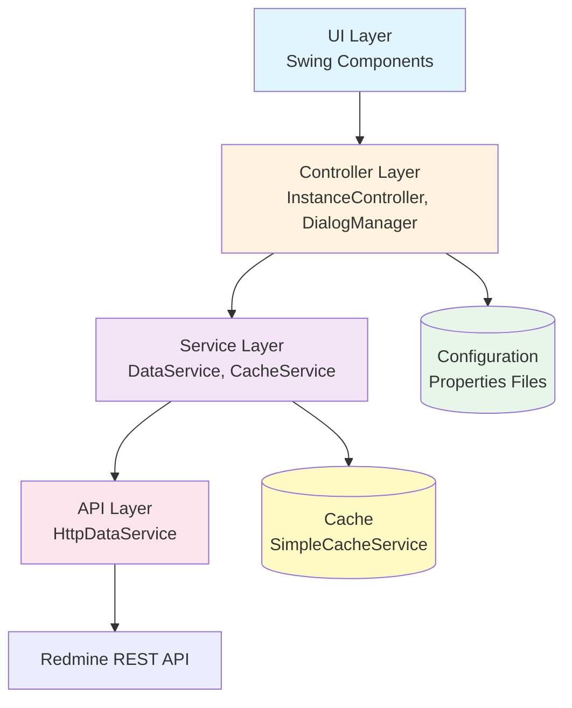
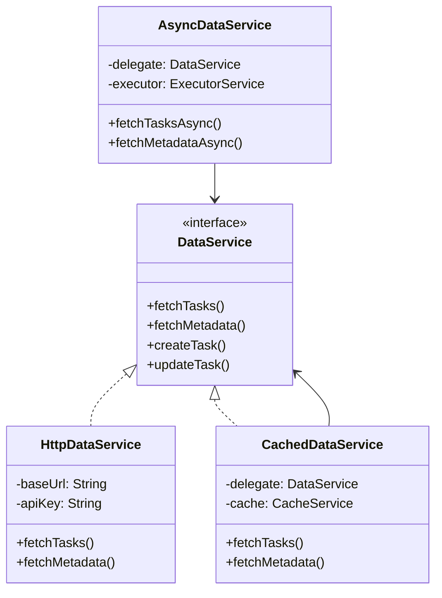
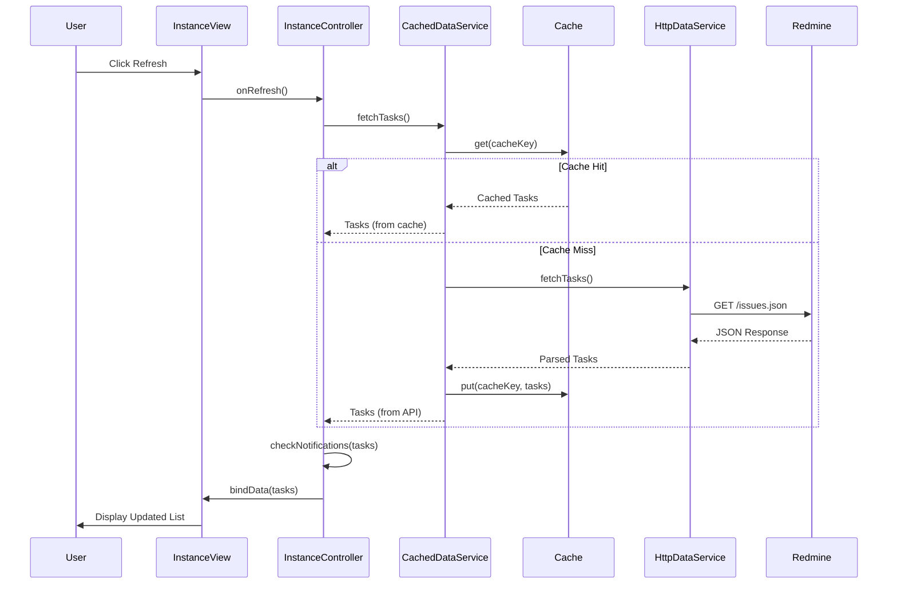

# Redmine Connector - Architecture Documentation

## Table of Contents
1. [System Overview](#system-overview)
2. [Architecture Layers](#architecture-layers)
3. [Core Components](#core-components)
4. [Service Layer](#service-layer)
5. [UI Architecture](#ui-architecture)
6. [Data Flow](#data-flow)
7. [Design Patterns](#design-patterns)
8. [Threading Model](#threading-model)
9. [Caching Strategy](#caching-strategy)
10. [Notification System](#notification-system)
11. [Configuration Management](#configuration-management)
12. [Security](#security)
13. [Testing](#testing)
14. [Performance](#performance)
15. [Deployment](#deployment)

---

## 1. System Overview

**Redmine Connector Pro** is a desktop Java Swing application that provides an enhanced interface for managing Redmine projects. It supports multiple concurrent connections, offline operation, advanced filtering, and cross-server task synchronization.

### Key Features
- Multi-instance client management
- Offline-first architecture with intelligent caching
- Real-time desktop notifications
- Twin task synchronization between servers
- Advanced reporting and metrics
- Customizable themes and UI
- Keyboard-driven workflow

### Technology Stack
- **Language**: Java 8+
- **UI Framework**: Swing
- **Build Tool**: Apache Ant
- **HTTP Client**: HttpURLConnection (built-in)
- **JSON Parsing**: Manual (no external dependencies)
- **Concurrency**: CompletableFuture
- **Caching**: ConcurrentHashMap
- **Testing**: Custom framework

---

## 2. Architecture Layers

The architecture follows a **layered design pattern** with clear separation of concerns:



### Layer Responsibilities

#### UI Layer (`redmineconnector.ui`)
- **MainFrame**: Application shell, menu bar, tab management
- **InstanceView**: Task list, filters, quick view panel
- **DialogManager**: Centralized dialog creation and management
- **Components**: Reusable UI widgets (FiltersPanel, TaskTablePanel, NotificationButton, etc.)

**Responsibilities:**
- Render user interface
- Handle user input
- Display data from service layer
- Manage UI state

#### Controller Layer
- **InstanceController**: Orchestrates data fetching, UI updates, and user actions for each client instance
- **MetadataManager**: Manages project metadata (statuses, priorities, users, versions)
- **TaskManager**: Handles task-specific operations (pinning, favorites)
- **TaskOperations**: Complex task operations (cloning, twin matching, bulk updates)

**Responsibilities:**
- Coordinate between UI and service layer
- Handle async callbacks and update UI thread
- Manage application state
- Implement business logic for UI interactions

#### Service Layer (`redmineconnector.service`)
- **DataService**: Interface defining all data operations
- **HttpDataService**: HTTP implementation using Redmine REST API
- **AsyncDataService**: Asynchronous wrapper with CompletableFuture
- **CachedDataService**: Decorator adding caching layer
- **CacheService**: Cache management interface
- **SimpleCacheService**: Thread-safe LRU cache implementation

---

## 3. Core Components

### 3.1 Main Application Entry

**File**: `RedmineConnectorApp.java`

```java
public class RedmineConnectorApp {
    public static void main(String[] args) {
        // Global exception handler
        Thread.setDefaultUncaughtExceptionHandler(...);
        
        // Initialize UI on EDT
        SwingUtilities.invokeLater(() -> {
            setupLookAndFeel();
            new MainFrame().setVisible(true);
        });
    }
}
```

**Responsibilities**:
- Set up uncaught exception handler
- Configure system Look & Feel
- Initialize MainFrame on Event Dispatch Thread

### 3.2 MainFrame

**File**: `ui/MainFrame.java`

**Key Features**:
- Multi-tab interface for multiple Redmine instances
- Global menu bar with File, View, and dynamic client menus
- Notification button in menu bar
- Keyboard shortcut management
- Log panel at bottom
- Progress bar for async operations
- Detachable windows for multi-monitor setups

### 3.3 InstanceController

**File**: `ui/InstanceController.java`

**Key Methods**:
- `refreshData()` - Fetches tasks and metadata from server
- `onCreate()` - Opens dialog to create new task
- `onEdit(Task)` - Opens task edit dialog
- `onDelete(Task)` - Deletes task with confirmation
- `checkNotifications(List<Task>)` - Scans for notification-worthy events
- `findTwin(Task)` - Searches peer servers for matching twin task

---

## 4. Service Layer

### Service Hierarchy



### DataService Interface

Defines all operations for interacting with Redmine:
- Task management (CRUD)
- Metadata fetching (users, trackers, priorities, etc.)
- File operations (upload/download)
- Time tracking
- Version management
- Wiki operations

### HttpDataService

- Implements `DataService` using HTTP REST calls
- Handles pagination for large datasets
- Constructs URLs and manages API authentication
- Parses JSON responses manually
- Supports both API key and Basic Auth

### CachedDataService (Decorator)

**Caching Strategy:**

| Data Type | Cached? | TTL | Invalidation |
|-----------|---------|-----|--------------|
| Tasks | ❌ No | - | - |
| Task Details | ❌ No | - | - |
| Metadata | ✅ Yes | 30 min | On task create |
| Versions | ✅ Yes | 5 min | On version CRUD |
| Wiki Pages | ✅ Yes | 15 min | On wiki update |
| Time Entries | ❌ No | - | - |

### AsyncDataService (Wrapper)

- Wraps any `DataService` implementation
- Provides `CompletableFuture`-based async methods
- Uses dedicated thread pool (default: 4 threads)
- Handles exceptions and wraps in `RuntimeException`

---

## 5. UI Architecture

### Component Hierarchy

```
MainFrame
├── MenuBar
│   ├── File Menu
│   ├── View Menu
│   ├── Client Menus (dynamic)
│   └── NotificationButton
├── TabbedPane
│   └── InstanceView (per client)
│       ├── FiltersPanel
│       ├── TaskTablePanel
│       └── QuickViewPanel
└── LogPanel
```

### Key UI Components

#### FiltersPanel
Provides filtering controls:
- Text search (ID, Subject)
- Exclusion keywords
- Date range pickers
- Multi-select dropdowns (Status, Tracker, Assignee, Version, Category)
- Quick filter buttons (My Tasks, Overdue, Today)

#### TaskTablePanel
Custom table with:
- **TaskTableModel**: Custom table model for Task objects
- **EnhancedRenderer**: Custom cell renderer with priority icons, status colors, hover effects
- **TableRowSorter**: Multi-column sorting
- **Column management**: Show/hide columns via header context menu

#### NotificationButton
Displays bell icon with badge showing unread count, opens NotificationCenter on click.

---

## 6. Data Flow

### Task Refresh Flow



### Offline Mode Transition

When `HttpDataService` encounters a connection error:
1. Exception is caught in `CachedDataService`
2. Cache is checked for last successful data
3. If cache exists, data is returned with offline flag
4. `InstanceController` receives offline flag
5. View is updated to show "OFFLINE MODE" indicator
6. Write operations are disabled

---

## 7. Design Patterns

### 1. Decorator Pattern
**Used in:** `CachedDataService`

Adds caching behavior to any `DataService` implementation without modifying the original class.

```java
DataService base = new HttpDataService(url, key, logger);
DataService cached = new CachedDataService(base, cache);
```

### 2. Wrapper Pattern
**Used in:** `AsyncDataService`

Wraps synchronous operations with asynchronous equivalents.

```java
AsyncDataService async = new AsyncDataService(cachedService);
CompletableFuture<List<Task>> future = async.fetchTasksAsync(...);
```

### 3. Strategy Pattern
**Used in:** `DataService` interface

Allows different implementations (HTTP, mock, cached) to be used interchangeably.

### 4. Observer Pattern
**Used in:** UI event handling and notifications

Swing components notify controllers of user actions. NotificationManager notifies listeners of new notifications.

### 5. Factory Pattern
**Used in:** `DialogManager`, `UIHelper`

Creates dialogs and UI components based on type.

### 6. Singleton Pattern
**Used in:** `NotificationManager`, `ConfigManager`

Single instances for global state management.

### 7. Model-View-Controller (MVC)
**Used in:** Overall architecture

Separates data (Model), presentation (View), and logic (Controller).

---

## 8. Threading Model

### UI Thread
- All Swing components run on Event Dispatch Thread (EDT)
- UI updates must use `SwingUtilities.invokeLater()`

### Worker Threads
- HTTP requests execute on `AsyncDataService` thread pool
- Default: 4 threads, configurable
- Named threads: `AsyncDataService-1`, `AsyncDataService-2`, etc.

### Cache Cleanup Thread
- Single daemon thread for periodic cleanup
- Runs every 60 seconds
- Removes expired cache entries

---

## 9. Caching Strategy

### SimpleCacheService Features

- **Thread-safe** using `ConcurrentHashMap`
- **TTL-based expiration**: Each entry has timestamp
- **LRU eviction**: Removes least recently used when full
- **Max size**: Configurable (default 1000 entries)
- **Pattern-based invalidation**: Wildcards supported
- **Periodic cleanup**: Every 60 seconds

### Cache Policies

| Operation | TTL | Invalidation |
|-----------|-----|--------------|
| fetchMetadata | 30 min | On task create/update |
| fetchVersionsFull | 5 min | On version CRUD |
| fetchWikiPages | 15 min | On wiki update |

**Advantages:**
- Reduces HTTP requests by ~70%
- Supports offline mode (returns cache if network fails)
- Automatic invalidation on mutations

---

## 10. Notification System

**File**: `notifications/NotificationManager.java`

### Components
- **System Tray Integration**: Uses `java.awt.SystemTray`
- **Notification History**: Persistent list of notifications
- **Task Tracking**: Prevents duplicate notifications
- **Event Listeners**: Notifies UI components of new notifications

### Notification Types

```java
enum Type {
    NEW_TASK,      // New task created/assigned
    ASSIGNMENT,    // Task assigned to user
    STATUS_CHANGE, // Task status changed
    COMMENT,       // New comment added
    DUE_DATE,      // Due date approaching
    OVERDUE        // Task is overdue
}
```

### Persistence
- `.redmine_notifications.dat` - Notification history (max 100 entries)
- `.redmine_notified_tasks.dat` - Set of notified task IDs (prevents duplicates)

---

## 11. Configuration Management

### Configuration Files

#### Application Config: `redmine_config.properties`

```properties
app.language=es
clients.list=client1,client2

# Client 1
client1.clientName=Production Server
client1.url=https://redmine.company.com/
client1.apiKey=abc123...
client1.projectId=my-project
client1.taskLimit=500
client1.refreshInterval=5
client1.downloadPath=C:/Downloads/Redmine
client1.refPattern=[Ref #{id}]
client1.folderPattern={id}_{subject}
client1.showClosedByDefault=false
```

### ConnectionConfig Class

**File**: `config/ConnectionConfig.java`

Contains all connection and behavior settings per client:
- Connection details (URL, API key, project ID)
- Behavior (task limit, refresh interval, download path)
- Twin synchronization (reference pattern, folder pattern)
- View configuration (column widths, visibility)
- Status colors

---

## 12. Security

### Authentication
- **API Key** (recommended): `X-Redmine-API-Key` header
- **Basic Auth**: Username + Password (Base64 encoded)

### API Key Storage
⚠️ **Warning**: Stored in plain text in `redmine_config.properties`
- File should have restricted permissions (600 on Unix)
- Future enhancement: Encrypt using Java Keystore

### SSL/TLS
- By default, validates SSL certificates
- Can be disabled for self-signed certificates (not recommended for production)

### Input Validation
- Subject is required (non-empty)
- Dates must be valid ISO format
- IDs must be positive integers
- File size limits enforced
- MIME type validation
- Path traversal prevention

---

## 13. Testing

### Test Structure

**Directory**: `src/main/java/redmineconnector/test`

**Test Classes**:
- `JsonParserTest` - JSON parsing validation
- `TaskTest` - Task model validation
- `StyleConfigTest` - Theme configuration
- `ConnectionConfigTest` - Connection settings
- `AsyncDataServiceTest` - Async operations
- `CacheServiceTest` - Cache functionality
- `CachedDataServiceTest` - Integration tests
- `SecurityUtilsTest` - Security utilities

### Running Tests

```bash
java -cp bin redmineconnector.test.RunAllTests
```

**Coverage**: >80% for service layer

---

## 14. Performance

### Optimizations Implemented

1. **Caching**: Reduces HTTP requests by ~70%
2. **Async Operations**: Non-blocking UI
3. **Pagination**: Fetches data in batches of 100
4. **Connection Pooling**: Reuses HTTP connections
5. **Lazy Loading**: Loads data only when needed

### Performance Metrics

- **Metadata fetch**: ~50ms (cached) vs ~500ms (uncached)
- **Task list (100 items)**: ~1-2 seconds
- **UI responsiveness**: No freezing during data fetch

---

## 15. Deployment

### Build Process

**Requirements**:
- Java 8 or higher
- Apache Ant

**Build Commands**:
```bash
# Clean and build
ant build

# Create JAR only
ant jar

# Run application
ant run
```

### Distribution

**Package Structure**:
```
RedmineConnector/
├── RedmineConnector.jar
├── redmine_config.properties.template
├── README.md
└── docs/
```

### System Requirements

**Minimum**:
- Java Runtime Environment (JRE) 8+
- 512 MB RAM
- 100 MB disk space
- Network access to Redmine server

**Recommended**:
- Java 11+
- 1 GB RAM
- 500 MB disk space (for cache and attachments)
- Stable internet connection

---

## Conclusion

The architecture balances simplicity with functionality:
- ✅ No external dependencies
- ✅ Clear separation of concerns
- ✅ Extensible design (decorators, wrappers)
- ✅ Good performance (caching, async)
- ⚠️ Security needs improvement (credential encryption)
- ⚠️ Manual JSON parsing is fragile

For detailed API usage, see [API_USAGE.md](API_USAGE.md).

---

**© 2025 Redmine Connector Pro - Architecture Documentation**
